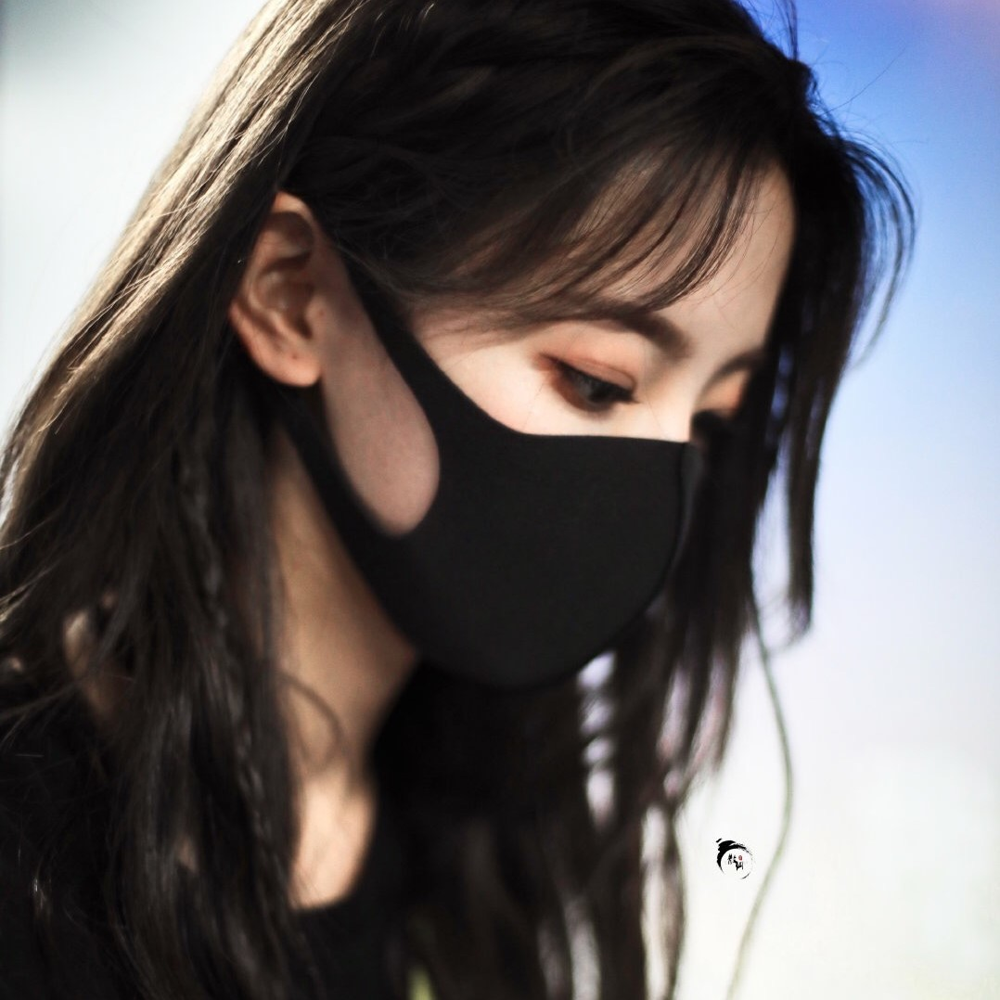
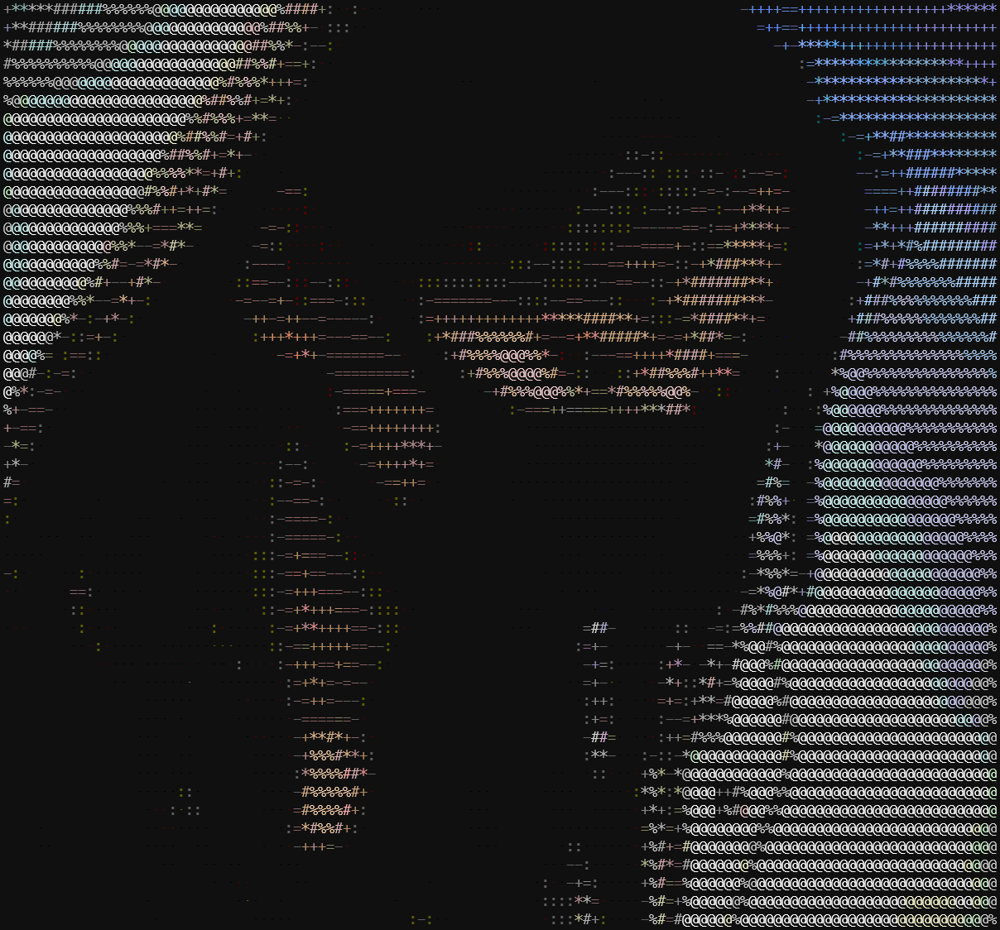
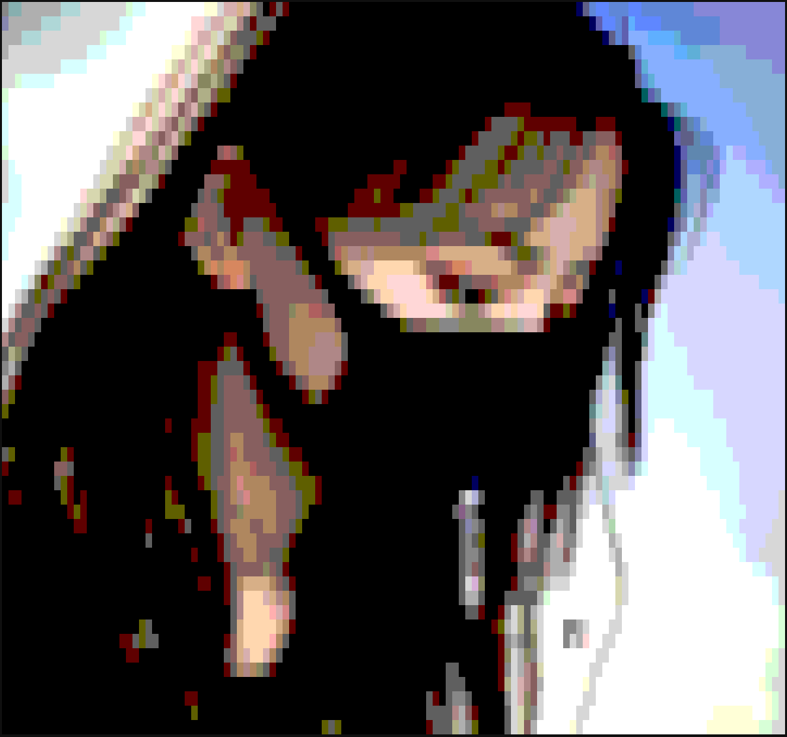
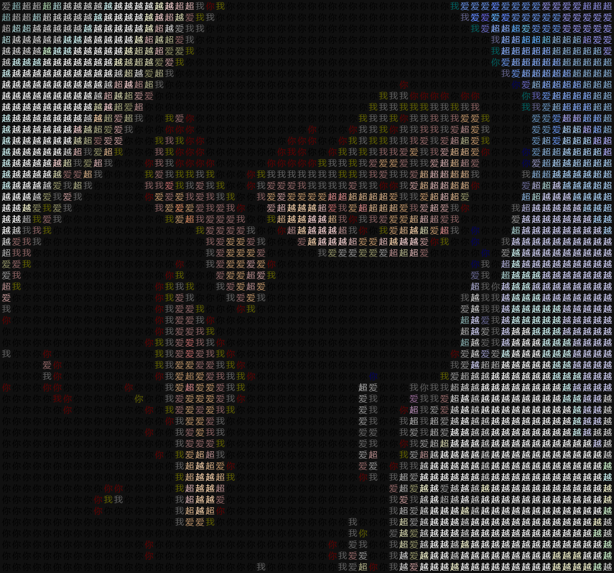
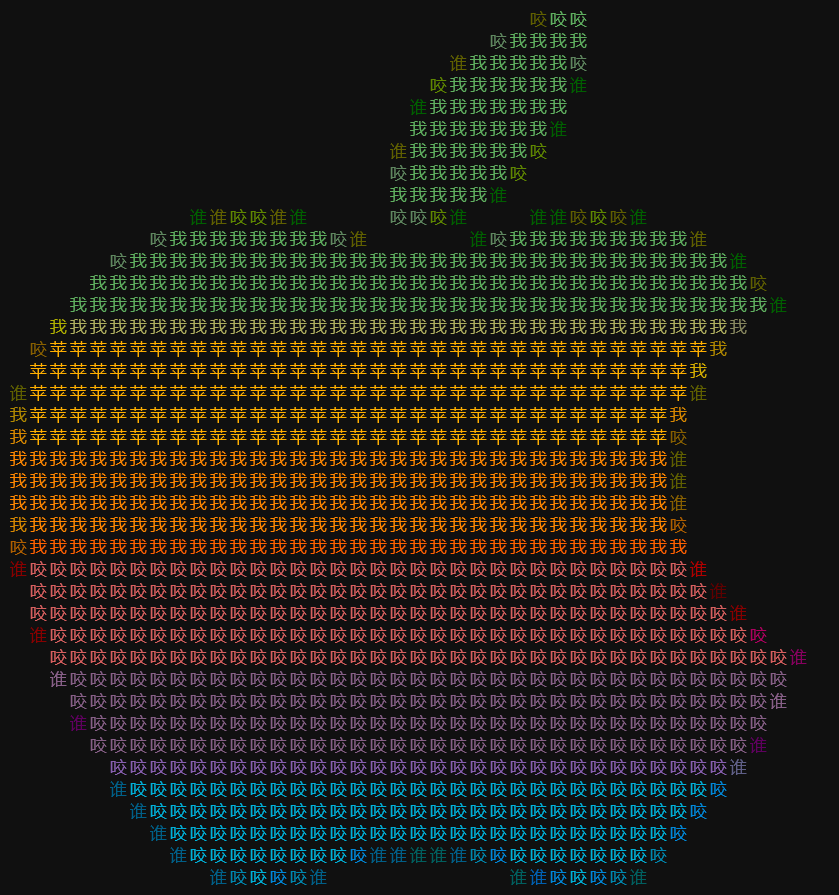
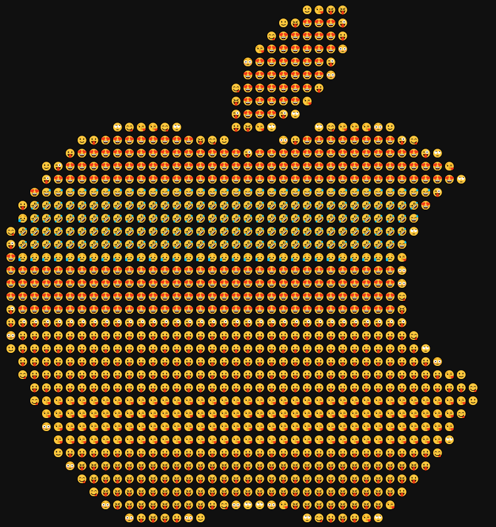
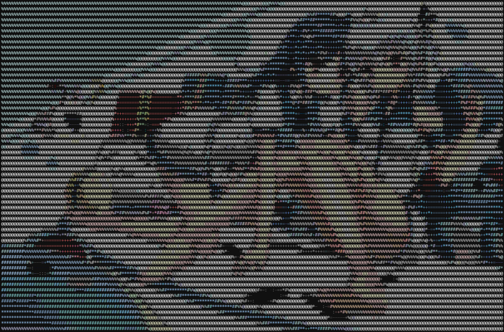

# ansify

<div align="center">

[](https://github.com/lonsty/ansify/actions?query=workflow%3Abuild)
[](https://pypi.org/project/ansify/)
[](https://github.com/lonsty/ansify/pulls?utf8=%E2%9C%93&q=is%3Apr%20author%3Aapp%2Fdependabot)

[](https://github.com/psf/black)
[](https://github.com/PyCQA/bandit)
[](https://github.com/lonsty/ansify/blob/master/.pre-commit-config.yaml)
[](https://github.com/lonsty/ansify/releases)
[](https://github.com/lonsty/ansify/blob/master/LICENSE)

Awesome `ansify` is a Python CLI to create ANSI/ASCII art from images.

好玩的终端图片艺术工具

</div>

## 工具特点

- [X] 任意图片转成任意字符
- [X] 支持彩色输出

## 使用说明

### 安装工具 ansify

```bash
pip install -U ansify
```

### Let's go

原图



- 黑白

```bash
ansify --columns 120 --no-color examples/ycy.jpg
```


- 彩色

```bash
ansify --columns 120 examples/ycy.jpg
```



- 像素

```bash
ansify --columns 120 --grayscale pixel examples/ycy.jpg
```



- 自定义字符

```bash
ansify --columns 120 --diy-grayscale "你我爱超越" examples/ycy.jpg
```



- 其他示例


```bash
ansify --columns 80 --diy-grayscale " 谁咬我苹果" examples/apple.png
```




```bash
ansify --columns 80 --grayscale emoji examples/apple.png
```



```bash
ansify https://b-ssl.duitang.com/uploads/item/201712/06/20171206200408_txunr.thumb.700_0.jpeg
```



### 参数说明

```bash
$ ansify --help
Usage: ansify [OPTIONS] IMAGE

  CLI to create ANSI/ASCII art from images.

Arguments:
  IMAGE  Image file PATH or URL.  [required]

Options:
  -c, --columns INTEGER           Output columns, number of characters per
                                  line.  [default: 252]

  -o, --output PATH               Save ANSI/ASCII art to the OUTPUT file.
  -s, --scale FLOAT               The larger the scale, the thinner the art.
                                  [default: 0.43]

  -g, --grayscale [simple|morelevels|pixel|dragon|emoji]
                                  Choose a built-in gray scale.  [default:
                                  simple]

  -d, --diy-grayscale TEXT        Customize your gray scale.
  -n, --no-color                  Output a ANSI/ASCII art without color.
                                  [default: False]

  -r, --reverse-grayscale         Reverse the grayscale.  [default: False]
  -R, --reverse-color             Reverse the color.  [default: False]
  -q, --quite                     Hide output information.  [default: False]
  -v, --version                   Prints the version of the ansify package.
  --help                          Show this message and exit.
```
必要参数：

- `IMAGE`: 本地图片文件路径，或者网络图片 URL

可选参数：

- `-c, --columns`：转化后图片的列数（汉字占两个字符，列数会减半），默认为终端的宽度
- `-o, --output`：指定文件名如 `output.txt` 后，将输出字符保存到文件
- `-s, --scale`：受终端配置（字间距、行高）与字符长宽比的影响，输出图像的长宽比与原图有差别。必要时使用此参数调整长宽比，该值越大，图片越高瘦
- `-g, --grayscale`：预设的几种灰阶递增（字符越来越密集）字符，`[simple|morelevels|pixel|dragon|emoji]`
- `-d, --diy-grayscale`：自定义灰阶字符，可以是单字符，多字符最好灰阶递增或递减
- `-n, --no-color`：禁用彩色
- `-r, --reverse-grayscale`：灰阶字符反转，终端背景为亮色时可以试试看
- `-R, --reverse-color`：颜色反转
- `-q, --quite`：输出结果中，屏蔽除字符图的其他信息

其他：

- `-v, --version`：打印工具版本信息
- `--help`：打印工具使用说明

## Release History

### 1.0.0

Initial release on PyPI.
## 🛡 License

[](https://github.com/lonsty/ansify/blob/master/LICENSE)

This project is licensed under the terms of the `MIT` license. See [LICENSE](https://github.com/lonsty/ansify/blob/master/LICENSE) for more details.

## 📃 Citation

```
@misc{ansify,
  author = {lonsty},
  title = {Awesome `ansify` is a Python CLI to create ANSI/ASCII art from images.},
  year = {2021},
  publisher = {GitHub},
  journal = {GitHub repository},
  howpublished = {\url{https://github.com/lonsty/ansify}}
}
```

## Credits

This project was generated with [`python-package-template`](https://github.com/TezRomacH/python-package-template).
